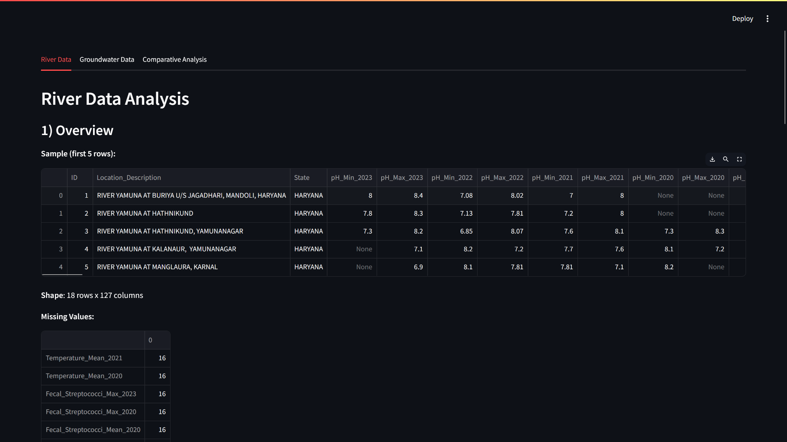
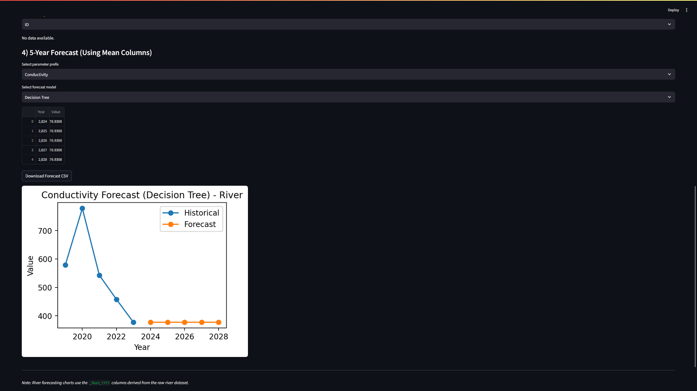
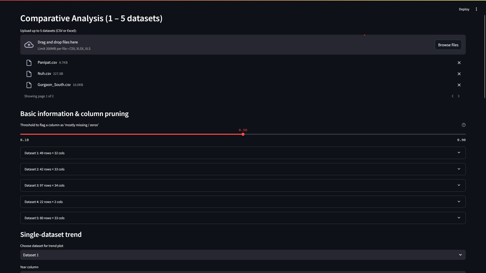
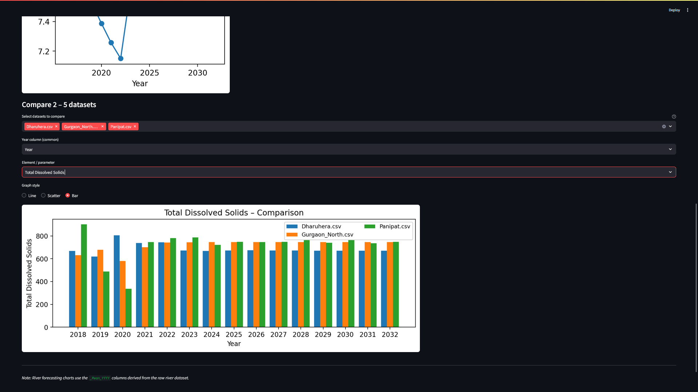

# AquaDash

# 💧 AquaDash – Local‑First Water‑Quality Explorer

A **Streamlit** dashboard for exploring, forecasting, and comparing river & groundwater datasets. Everything runs on your machine – no external APIs – so sensitive environmental data stays private.

---

## ✨ Key Features

|                          | Description                                                                                                                                |
| ------------------------ | ------------------------------------------------------------------------------------------------------------------------------------------ |
| **Drop‑in data uploads** | Accepts up to **5 CSV/XLS(X)** files at once; automatically shows shape & missing‑value counts.                                            |
| **Smart column pruning** | Slider flags columns that are mostly *NaN* / zeros, letting you hide noisy features before plotting.                                       |
| **Contextual graphs**    | Detects `_Min_YYYY` / `_Max_YYYY` patterns, builds on‑the‑fly `_Mean_YYYY` values, and lets you plot yearly trends with one click.         |
| **5‑year forecasts**     | Choose **Decision Tree, Random Forest, or Linear Regression** to extrapolate any numeric parameter five years ahead – downloadable as CSV. |
| **Side‑by‑side plots**   | Figures are sized so that **two graphs fit neatly next to each other** on a laptop/desktop screen.                                         |
| **True file legends**    | Comparison charts use your real **file names** – no more “Dataset 1, 2…” confusion.                                                        |
| **Offline stack**        | Pure **Pandas + scikit‑learn + Matplotlib** inside Streamlit. Runs in a lightweight virtual‑env; no cloud or heavy dependencies.           |

---

## 📸 Demo

|                   River overview                   |                 Forecast & comparisons                 |
| :------------------------------------------------: | :----------------------------------------------------: |
|                                 |                                      |
|                   Upload & prune                   |                 Multi‑dataset bar chart                |
|                                    |                                           |


---

## 🏗️ Architecture

```text
river.csv / groundwater.xlsx            ⇣   Exploratory summaries
                                       river.py / groundwater.py
                                      ────────────────────────────► Trend plot / Forecast (sklearn)

Multiple user‑uploaded datasets (1‑5)  ⇣   comparative.py
                                      ────────────────────────────► Column pruning → Single‑trend → Multi‑dataset comparison

main.py  ── Streamlit navigation (tabs)  ═══════════════════════►  UI rendered at http://localhost:8501
```

---

## 🚀 Quick Start

```bash
# 1  Clone & move into project
$ git clone <your‑fork‑url>
$ cd aqua‑dash

# 2  (Optional) create virtual env
$ python -m venv .venv && source .venv/bin/activate  # Windows: .venv\Scripts\activate

# 3  Install requirements
$ pip install -r requirements.txt

# 4  Add the sample data (or your own)
$ cp path/to/river.csv path/to/Modified_filled.xlsx .

# 5  Launch Streamlit
$ streamlit run main.py
```

Open the printed URL (usually [http://localhost:8501](http://localhost:8501)) – you’ll start on the **River Data** tab.

---

## ⚙️ Configuration

| Setting                     | Where                                          | Default      |
| --------------------------- | ---------------------------------------------- | ------------ |
| **Figure size**             | `river.py`, `groundwater.py`, `comparative.py` | `(4, 3)`     |
| **Forecast models offered** | `helpers.py → MODELS`                          | DT / RF / LR |
| **Missing‑value threshold** | Slider in **Comparative** tab (UI)             | `0.1 → 0.9`  |

Most tweaks are simple one‑liners inside the respective modules.

---

## 📂 Project Structure

```text
.
├── main.py               # Streamlit entry‑point (defines 3 tabs)
├── river.py              # River‑data logic & plots
├── groundwater.py        # Groundwater‑data logic & plots
├── comparative.py        # Multi‑dataset comparison logic
├── river.csv             # Sample river dataset (CSV)
├── Modified_filled.xlsx  # Sample groundwater dataset (XLSX)
├── requirements.txt      # Python dependencies
└── docs/
    └── screenshots/
        ├── river_overview.png
        ├── groundwater_forecast.png
        ├── comparative_upload.png
        └── comparative_bar.png
```


## © License

MIT – use it, remix it, just keep the notice and cite the repo if you publish.

---

## 🤝 Contributing

Issues & PRs welcome! Open a discussion first if you’re adding a major feature.

---

Made with ❤️ in India.
